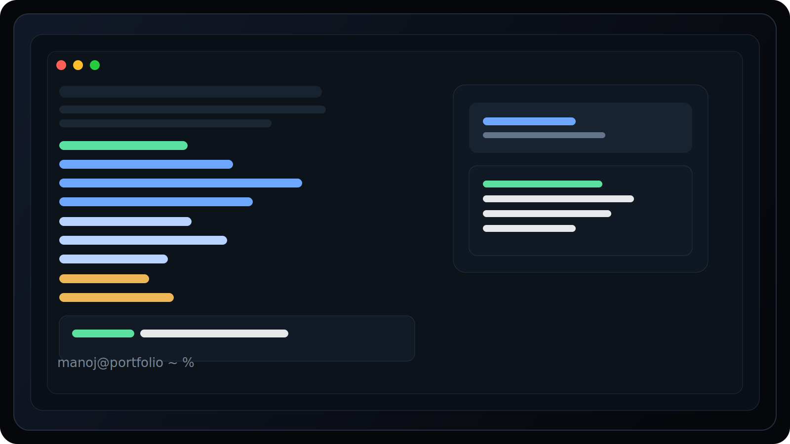
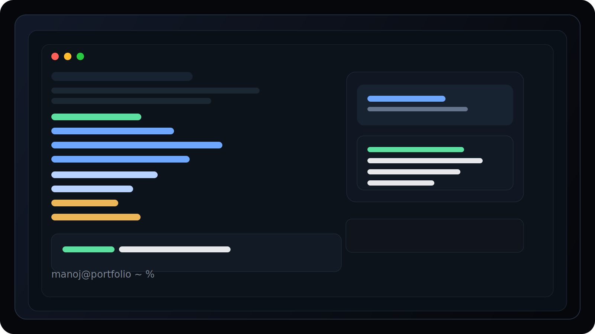

# Manoj S | Terminal Portfolio

A premium, interactive terminal-style portfolio built with Django. This project reimagines a personal portfolio as a realistic command-line experience, combining modern UI design, strong developer branding, and a memorable first impression.



## Overview

This portfolio is designed to feel more like a product experience than a traditional website. Instead of a passive landing page, visitors can interact with the portfolio through terminal-style commands such as help, about, projects, contact, and neofetch.

### Why it stands out

- A unique and memorable user experience
- A polished, futuristic visual identity
- Strong developer-brand storytelling
- Easy-to-update content through Python data files
- Built to scale into a full personal platform

## Project Gallery



## Key Features

- Interactive terminal command experience
- Responsive layout for desktop and mobile
- Custom terminal styling inspired by macOS Terminal
- Professional sections for about, education, skills, projects, and contact
- Clean separation of content and presentation

## Tech Stack

- Python
- Django
- HTML, CSS, and JavaScript
- SQLite for local development

## Project Structure

```text
portfolio_django/
├── manage.py
├── requirements.txt
├── config/
│   ├── settings.py
│   └── urls.py
├── terminal_app/
│   ├── data.py
│   ├── views.py
│   ├── urls.py
│   ├── templates/terminal_app/index.html
│   └── static/terminal_app/
│       ├── css/style.css
│       └── js/terminal.js
└── assets/
    ├── terminal-portfolio-preview.svg
    └── terminal-portfolio-showcase.svg
```

## Run Locally

```powershell
cd E:\Users\INDIAN\Downloads\portfolio_django\portfolio_django
python -m venv venv
.\venv\Scripts\Activate.ps1
pip install -r requirements.txt
python manage.py migrate
python manage.py runserver 0.0.0.0:8000
```

Then open:

```text
http://127.0.0.1:8000/
```

## Content Management

Your portfolio content is centralized in:

- [terminal_app/data.py](terminal_app/data.py)

This makes it easy to update your profile, skills, projects, education, and contact details without touching the UI structure.

## Future Growth Ideas

1. Add a real contact form with email support
2. Introduce a dark/light mode toggle
3. Add richer command animations and sound feedback
4. Build a personal blog or notes experience inside the terminal
5. Add an AI assistant experience inside the portfolio
6. Add an admin dashboard to edit content without code
7. Expand into a full personal brand platform

## Deployment

This project is built for Django and should be hosted on a Python-compatible platform rather than GitHub Pages.

Recommended free options:

- Render
- Railway
- PythonAnywhere

Before deployment:

1. Set DEBUG to False
2. Add your domain to ALLOWED_HOSTS
3. Run collectstatic
4. Use environment variables for SECRET_KEY

## License

This project is intended for personal portfolio and professional showcase use.
